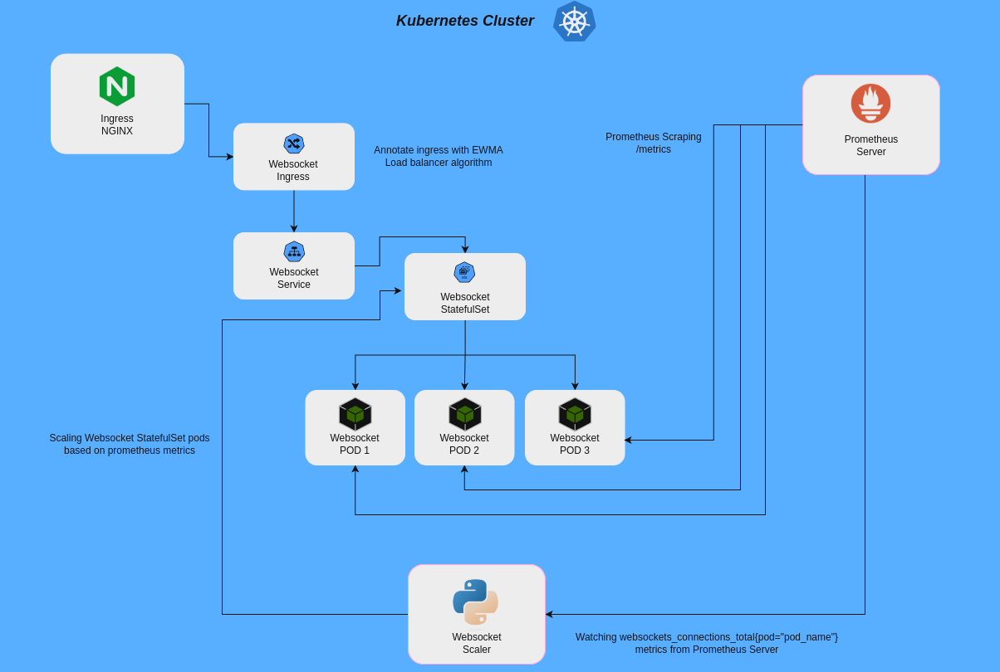

# WebSocket Horizontal Scaling Architecture
This project demonstrates an auto-scaling architecture for WebSocket servers running within a Kubernetes cluster, leveraging Prometheus metrics for dynamic scaling based on real-time usage.



## Architecture Overview
The architecture is composed of several components designed to work in tandem for providing a scalable, real-time WebSocket communication service:

- `websocket-client`: A Node.js application that simulates WebSocket connections to test the scalability and performance of the WebSocket server.
- `websocket-server`: A Node.js WebSocket server that handles incoming connections and emits standard WebSocket events.
- `websocket-scaler`: A Python application running within the Kubernetes cluster, tasked with collecting metrics from the `websocket-server` pods and performing scaling actions based on those metrics.

## Project Structure
The project is organized into the following directory structure:

- `/apps`
  - `/websocket-client`: Contains the WebSocket client simulation application.
  - `/websocket-server`: Contains the WebSocket server application.
  - `/websocket-scaler`: Contains the Kubernetes scaling application.
- `/kubernetes`
  - `/redis`: Contains Kubernetes manifests for Redis deployment, used for storing session data with persistence.
  - `/websocket-server`: Contains Kubernetes manifests for deploying the WebSocket server.
    - `service.yaml`: Service configuration with `sessionAffinity: ClientIP` to maintain session persistence.
    - `ingress.ws`: Ingress configuration with `nginx.ingress.kubernetes.io/load-balance: "ewma"` for efficient load balancing and `nginx.ingress.kubernetes.io/upgrade: "websocket"` to properly handle WebSocket upgrades.

## Deployment

### Prerequisites
Before deploying the WebSocket infrastructure, ensure that you have the following prerequisites installed:

- [Minikube](https://minikube.sigs.k8s.io/docs/start/)
- [Helm](https://helm.sh/docs/intro/install/)

### Minikube Installation and Setup
1. **Install Minikube**:
   Follow the [official Minikube installation guide](https://minikube.sigs.k8s.io/docs/start/) to install Minikube on your machine.

2. **Start Minikube**:
   Once installed, start a Minikube cluster using the following command:
   ```sh
   minikube start
    ```
3. **Verify the cluster**:
   Check the status of the cluster to ensure it's running:
   ```sh
   minikube status
    ```

### Helm & Prometheus Installation and Setup
1. **Fetch the script**:
   ```sh
   curl -fsSL -o get_helm.sh https://raw.githubusercontent.com/helm/helm/main/scripts/get-helm-3
    ```
2. **Add permisions to script**:
   ```sh
   chmod 700 get_helm.sh
    ```
3. **Execute the script**:
   ```sh
   ./get_helm.sh
    ```
4. **Add prometheus helm repository**:
   ```sh
   helm repo add prometheus-community https://prometheus-community.github.io/helm-charts
    ```
5. **Update helm repository**:
   ```sh
   helm repo update
    ```
6. **Install prometheus on minkube**:
   ```sh
   helm install prometheus prometheus-community/kube-prometheus-stack
    ```
7. **Verify prometheus installation**:
   Ensure that all the components are up and running:
   ```sh
   kubectl get all -n prometheus
    ```

### Deploying WebSocket Components
With Minikube and Prometheus running, you can now deploy the WebSocket components to the cluster:

1. **Deploy Redis:**:
   Navigate to the kubernetes/redis directory and apply the manifests:
   ```sh
   kubectl apply -f .
    ```
2. **Deploy WebSocket Server:**:
   Navigate to the kubernetes/websocket-server directory and apply the manifests for the StatefulSet and associated resources:
   ```sh
   kubectl apply -f .
    ```
3. **Deploy WebSocket Scaler:**:
   Navigate to the kubernetes/websocket-scaler directory and apply the manifests for the Deployment and associated resources:
   ```sh
   kubectl apply -f .
    ```
#### OBS: You can navigate to any app dir inside app/ and build your own docker image then change the image reference on StatefulSet or Deployment if you want to make any changes in the code, feel free :)

## Usage

The `connections.js` script in the `apps/websocket-client` directory is a Node.js application that simulates multiple WebSocket connections to test the scalability and performance of the WebSocket server. It attempts to establish a specified number of WebSocket connections, each with a delay between connections to avoid overwhelming the server.

### Running the WebSocket Client Simulation

To run the simulation, follow these steps:

1. **Navigate to the Client Application Directory**:
   Change into the `apps/websocket-client` directory where the `connections.js` script is located.
   ```sh
   cd apps/websocket-client
   ```
2. **Install Dependencies:**:
   Before running the script for the first time, make sure to install the necessary Node.js dependencies.
   ```sh
   npm install
   ```
3. **Run the script:**:
   Execute the connections.js script using Node.js.
   ```sh
   node src/connections.js
   ```
